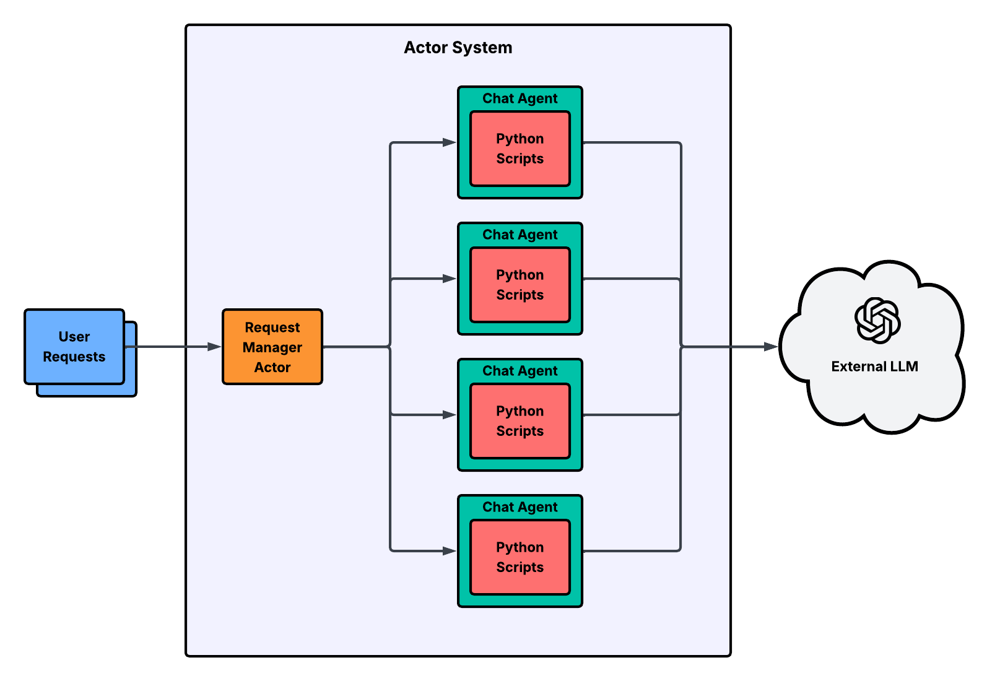

# Akka.NET with Python AI Agents

<p align="center"></p>

* Figure 1: High-level architecture showing concurrent user requests processed by Akka.NET actors which leverage Python scripts for AI agent interactions with an external LLM.*

This project demonstrates an Akka.NET application that integrates with Python scripts using Python.NET. 
It features a `RequestManagerActor` that receives simulated concurrent requests. For each request, it spawns a short-lived `ChatAgent` worker actor. Each `ChatAgent` is capable of executing functions within a Python script, passing unique `SessionId` and `UserId` parameters for traceability, and then terminates itself.

## Prerequisites

1.  **.NET SDK:** Version 8.0 or later.
2.  **Python:** Version 3.13 (as configured). Ensure it's installed and accessible. This project was developed using Python from Homebrew on macOS.
3.  **Python Virtual Environment:** The project is set up to use a Python virtual environment for managing Python dependencies.

## Setup

1.  **Clone the Repository:**
    ```bash
    git clone <repository-url>
    cd akka-ai-agents 
    ```

2.  **Create and Activate Python Virtual Environment:**
    From the project root directory (`akka-ai-agents`):
    ```bash
    python3 -m venv .venv
    source .venv/bin/activate
    ```
    *(On Windows, activation is `.venv\Scripts\activate`)*

3.  **Install Python Dependencies:**
    With the virtual environment activated, install the required Python packages using the `requirements.txt` file located at the project root:
    ```bash
    pip install -r requirements.txt
    ```
    This file lists all necessary Python packages and their versions for the project to run correctly.

4.  **Set Environment Variables:**
    Before running the .NET application, you **must** set the following environment variables in your terminal session where you intend to run `dotnet run`. **Ensure your virtual environment is active when setting these.**

    *   **`PYTHONNET_PYDLL`**: Path to your Python shared library.
        *   For Homebrew Python 3.13 on macOS (example):
            ```bash
            export PYTHONNET_PYDLL="/opt/homebrew/Frameworks/Python.framework/Versions/3.13/lib/libpython3.13.dylib"
            ```
        *   Adjust this path based on your Python installation location and version.

    *   **`PYTHONHOME`**: Path to the root of your Python installation's library structure.
        *   For Homebrew Python 3.13 on macOS (example):
            ```bash
            export PYTHONHOME="/opt/homebrew/Cellar/python@3.13/3.13.3/Frameworks/Python.framework/Versions/3.13"
            ```
        *   Adjust this path based on your Python installation. It's often the directory containing `lib` and `include` for your Python version.

    *   **`OPENAI_BASE`**: The base URL for your LiteLLM or OpenAI-compatible proxy.
        *   Example:
            ```bash
            export OPENAI_BASE="http://litellm.localtest.me"
            ```
        *   This is used by the Python agent (`Scripts/chat_agent/agent.py`) to connect to the LLM.

    *   **`OPENAI_KEY`**: The API key for your LLM service (can be a placeholder if your proxy doesn't require it, but the variable should be set).
        *   Example (if your proxy handles actual key management):
            ```bash
            export OPENAI_KEY="your_openai_or_proxy_api_key"
            ```
        *   This is used by the Python agent (`Scripts/chat_agent/agent.py`).

    *   **Optional: `PYTHONPATH`** (for reference, primarily handled by C# code during runtime)
        The C# `PythonScriptExecutor` dynamically adds all necessary paths to Python's `sys.path` at runtime. This includes the application's output directory (where scripts are copied) and the Python virtual environment's `site-packages`. Therefore, setting `PYTHONPATH` manually in your shell is generally **not required** for this application to function correctly.

        If you were to set it for other external tools or direct Python script execution outside this app, it might look like this:
        ```bash
        # Example for external use: export PYTHONPATH="/path/to/your/project/.venv/lib/python3.13/site-packages:/path/to/your/project/src/AkkaAgents/bin/Debug/net8.0"
        ```

    **Note:** These environment variables (`PYTHONNET_PYDLL`, `PYTHONHOME`) are set for the current terminal session. For persistent settings, add them to your shell's profile script (e.g., `~/.zshrc`, `~/.bash_profile`, or PowerShell profile).

## Running the Application

1.  **Ensure Prerequisites and Setup steps are complete.**
2.  **Activate your virtual environment:**
    ```bash
    source .venv/bin/activate
    ```
3.  **Set the required environment variables** (`PYTHONNET_PYDLL`, `PYTHONHOME`) in the same terminal session.
4.  **Navigate to the .NET project directory:**
    ```bash
    cd src/AkkaAgents
    ```
5.  **Run the application:**
    ```bash
    dotnet run
    ```

You should see output from the Akka.NET system, indicating the `RequestManagerActor` starting, followed by logs for multiple simulated requests. Each request will trigger the creation of a `ChatAgent` (e.g., `ChatAgent ($a)`, `ChatAgent ($b)`), which will process its message via the Python script (showing its unique `SessionId` and `UserId`), print the Python response, and then log that it is stopping.

## Project Structure

*   `src/AkkaAgents/`: Contains the .NET Akka application.
    *   `RequestManagerActor.cs`: Actor responsible for receiving requests and delegating them to `ChatAgent` workers.
    *   `ChatAgent.cs`: Worker actor that uses Python to process a single request and then terminates.
    *   `Utilities/PythonScriptExecutor.cs`: Helper class for Python.NET interaction, including `sys.path` management.
    *   `Scripts/script.py`: Example Python script called by `ChatAgent`.
    *   `Scripts/chat_agent/agent.py`: Core Python agent logic used by `script.py`.
    *   `Program.cs`: Main entry point, simulates multiple requests to the `RequestManagerActor`.
    *   `AkkaAgents.csproj`: Project file.
*   `README.md`: This file.
*   `requirements.txt`: Lists Python dependencies for the project.

## Troubleshooting Python.NET

*   **`No module named 'encodings'`**: `PYTHONHOME` is likely not set or incorrect.
*   **`BadPythonDllException` or `Failed to load symbol Py_IncRef`**: `PYTHONNET_PYDLL` is likely not set or incorrect, or points to an incompatible Python library.
*   **`No module named 'your_script_name'`**:
    *   Ensure the script is being copied to the output directory (check `.csproj`).
    *   Ensure `AppContext.BaseDirectory` (where the host .NET app runs) is effectively part of Python's `sys.path` when the script is imported. The `PythonScriptExecutor` attempts to add this.
*   **`No module named 'your_python_package'` (e.g., `emoji`)**:
    *   Ensure the package is installed in the correct virtual environment (`.venv/lib/python3.13/site-packages`).
    *   Ensure the path to this `site-packages` directory is correctly added to Python's `sys.path` by `PythonScriptExecutor.cs`.
    *   Verify `PYTHONHOME` is correctly set. 